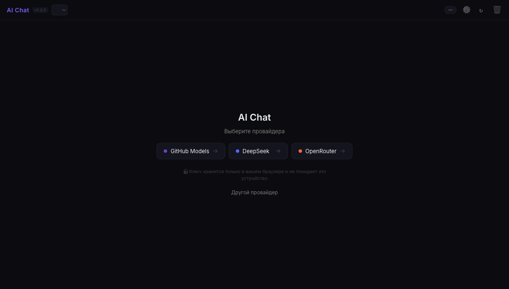

# AI Chat — local multi-provider client

Chat with AI models right in the browser: paste your own API key and talk.
No backend, no cloud, no sign-up: everything runs locally, your key never leaves your device.



**🌐 Versions:** [English](README.md) · [Русский](README.ru.md)

## Quick start

The client is three static files — no server required. Two ways to run it:

**Option 1 — open the file directly:**

```bash
open index.html
```

**Option 2 — local server (recommended):**

```bash
python3 -m http.server 8080
# then open http://localhost:8080
```

## First connection — 3 steps

1. **Pick a provider** on the start screen (or "Other provider" for manual setup).
2. **Get a key** — the "Get a key →" link under the API Key field goes to the provider's key page.
3. **Paste the key and press "Connect"** — the client validates the key, loads the model list and opens the chat.

## Where to get a key

| Provider | Where to get a key |
|---|---|
| GitHub Models | https://github.com/settings/tokens (Personal Access Token with Models access) |
| DeepSeek | https://platform.deepseek.com/api_keys |
| OpenRouter | https://openrouter.ai/keys |
| OpenAI | https://platform.openai.com/api-keys |
| Groq | https://console.groq.com/keys |

Any OpenAI-compatible endpoint works too ("Other (manual)"): set a name, endpoint URL and key.

## Security

- **The key is stored only in your browser's localStorage** — it is not sent anywhere except the API of the provider you chose.
- No server-side code: requests go directly from the browser to the provider API.
- Remove the key and all data: **Settings → "Delete key and settings"** (or clear localStorage manually).

## Features

- 6 providers out of the box + any OpenAI-compatible endpoint
- Auto-picks the best available model
- Streaming responses with stop generation
- Chat history (stored locally, up to 100 messages)
- System prompt, temperature, max tokens
- Markdown formatting and code blocks in responses
- Dark theme, mobile-friendly layout

## Stack and structure

Plain HTML/CSS/JS with no dependencies (except Google Fonts):

```
index.html      — markup
css/app.css     — styles, design tokens
js/app.js       — all logic (providers, streaming, settings)
```

## Versions

- **v1.2.0** — onboarding: "get a key" links, delete key & settings, error hints
- **v1.1.1** — stable prototype: multi-provider, streaming, history